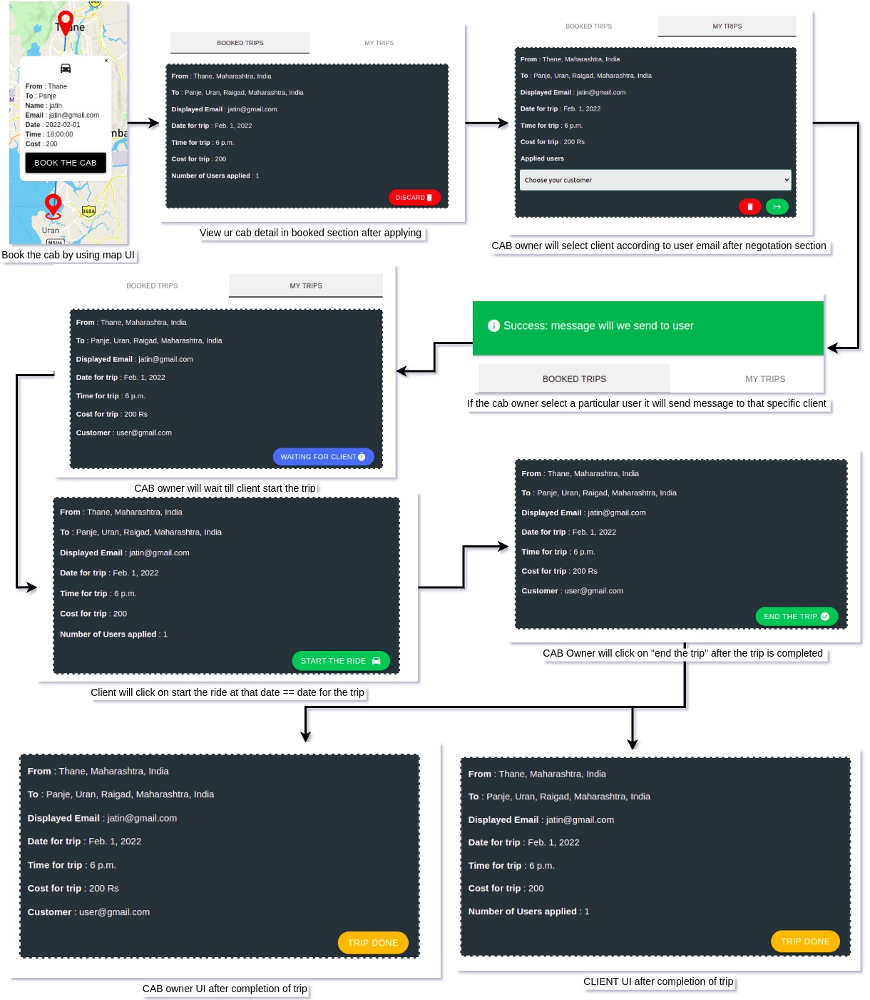
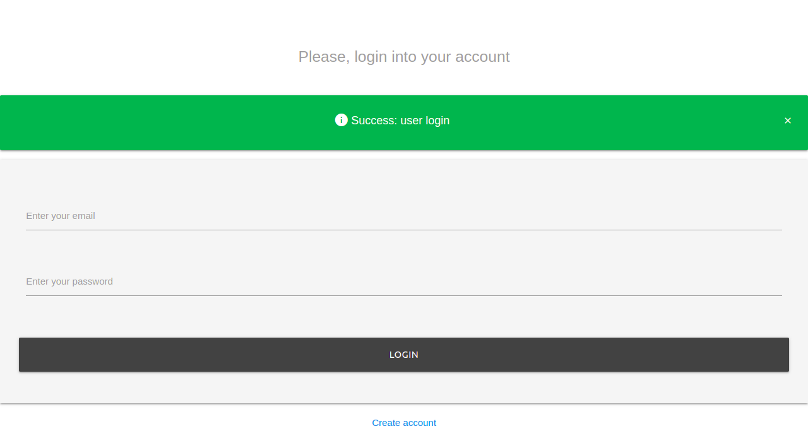
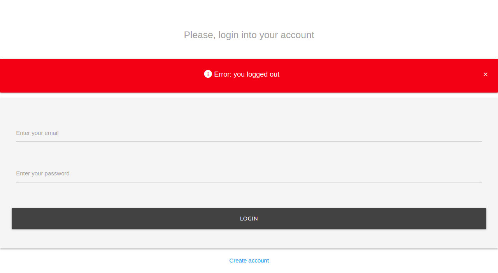
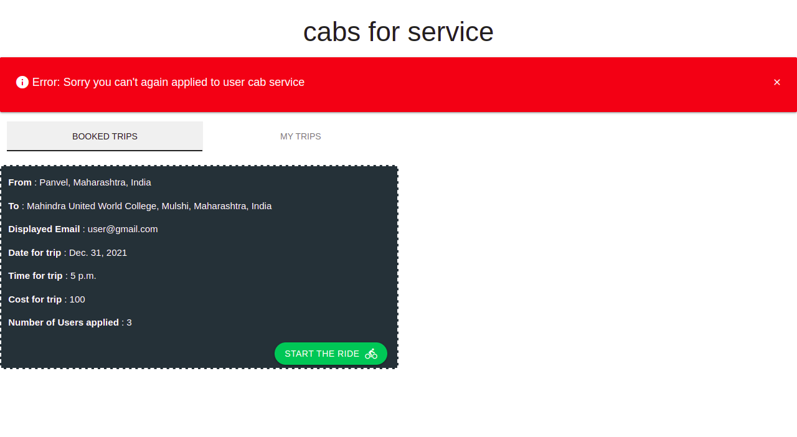
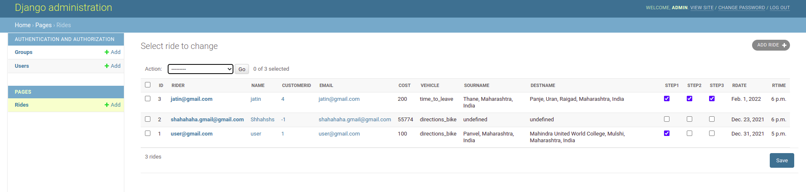

# UNOcabs

<a href="https://unocabs.herokuapp.com/">Unocabs</a>

# DETAILS
Web application that let's you create/books a cab service. It includes to track a your ride service and 3 step flow After booking a ride.

# Technology Stack
<ul>
  <li>Django, mapbox api</li> 
  <li>materlizecss for style</li>
  <li>mongo atlas for database</li>
  <li>heroku django server</li>
</ul>

# Product functions
<ul>
    <li>Create/apply for cabs services near you</li>
    <li>3 step flow after cab booking</li>
    <li>Place search implementation using mapbox Api.</li>
</ul>

# Below are some screenshot of the project

## Generic flow for cab service

    &nbsp;

# Login / logout alert using The messages framework

    &nbsp;
    &nbsp;

# Alert if a user try's to book the same ride again

    &nbsp;

# Form submition to create a generic cab service

    &nbsp;

# Admin panel

    &nbsp;

# Things to work on
<ul>
    <li>Work on home UI to show cabs service in list view</li>
    <li>Responsiveness on mobile screen</li>
</ul>
